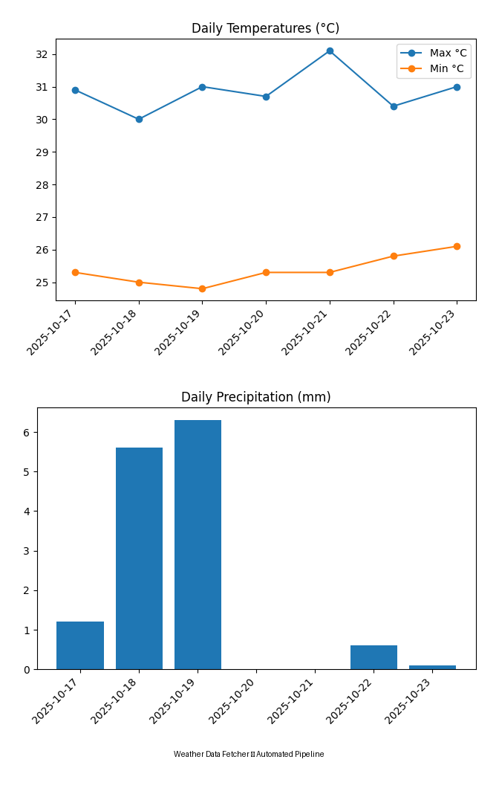

# Weather Data Fetcher — Automated Data Pipeline

Fetch daily Lagos (or any city) weather data using **Open-Meteo API**, process it with **Python**, and automate the full workflow via **Bash + Makefile**.

---

## Project Overview

This project demonstrates a clean, reproducible workflow for data automation — the same principles used in ML and DevOps pipelines.

**Pipeline Steps**

1. Download daily weather JSON from Open-Meteo
2. Parse, validate, and summarize data in Python
3. Generate text + CSV summaries (and optional plots)
4. Automate everything via a single `make all` command

---

## 📊 Charts

Visual summaries generated automatically with `make viz`:

| Temperature Trend           | Rainfall Pattern              |
| --------------------------- | ----------------------------- |
|  |  |

**Run:**

````bash
make viz

---

## Run Locally
Clone and run:
```bash
make all
````
