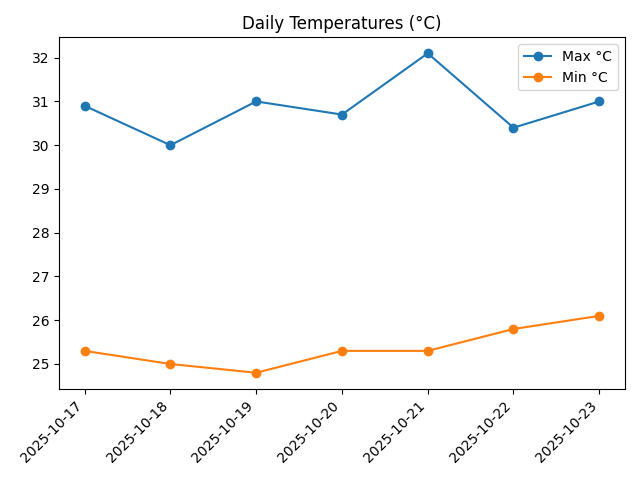
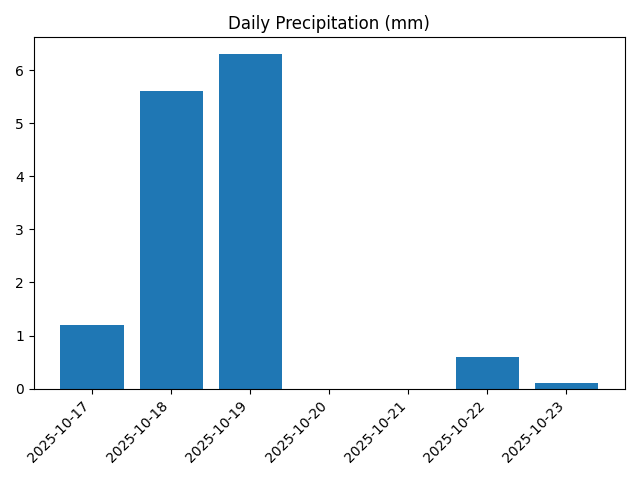
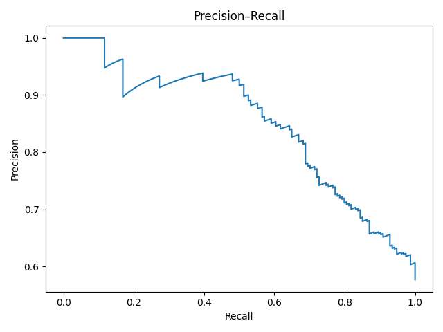
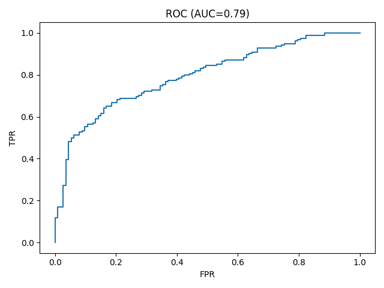
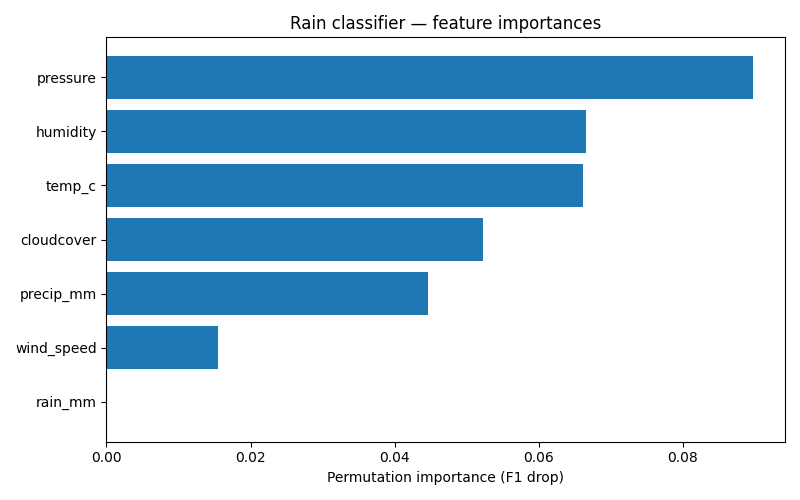

# Weather Data Fetcher — Automated Data Pipeline

Fetch daily Lagos (or any city) weather data using **Open-Meteo API**, process it with **Python**, and automate the full workflow via **Bash + Makefile**.

---

## Project Overview

This project demonstrates a clean, reproducible workflow for data automation — the same principles used in ML and DevOps pipelines.

**Pipeline Steps**

1. Download daily weather JSON from Open-Meteo
2. Parse, validate, and summarize data in Python
3. Generate text + CSV summaries (and optional plots)
4. Automate everything via a single `make all` command

---

## Charts
Visual summaries generated with `make viz`:

| Temperature trend | Rainfall pattern |
| ----------------- | ---------------- |
|  |  |

## 🌧️ Rain Warning (next 6 hours)

Predict **whether it will rain in the next 6 hours** from hourly observations (temperature, humidity, pressure, wind, cloud cover, precipitation).

| Mode           | Threshold | Precision | Recall | When to use          |
| -------------- | --------- | --------- | ------ | -------------------- |
| Default        | 0.50      | 0.71      | 0.70   | Balanced alerts      |
| High recall    | 0.35      | 0.68      | 0.84   | Better safe than sorry|
| High precision | 0.65      | 0.79      | 0.50   | Only warn if confident|

### Train once

```bash
make hourly
make rain-train
make rain-now
python scripts/train_rain_dual_thresholds.py
python scripts/plot_pr_roc.py  # refresh PR/ROC charts
```

This produces:
- `models/rain_classifier_hourly.joblib`
- `models/rain_model_meta.json`
- `results/pr_curve.png`, `results/roc_curve.png`

### Predict from the latest hour

```bash
weather-cli rain --mode recall     # warn more often
weather-cli rain --mode precision  # fewer false alarms
```

Example output:

```
2025-10-26 23:00:00 | P(rain ≤6h)=0.492 | mode=recall    thr=0.35 → RAIN
2025-10-26 23:00:00 | P(rain ≤6h)=0.492 | mode=precision thr=0.65 → No rain
```

### How thresholds are chosen

Training sweeps precision–recall trade-offs and stores two operating points:

| Threshold type | Purpose                        |
| -------------- | ------------------------------ |
| High recall    | Catch >80 % of rain events     |
| High precision | Warn only when ≥90 % confident |




### Model Interpretability

The model learned:

- **Coefficients (standardized):** which signals push toward rain vs no-rain  
  ```bash
  python scripts/coef_rain.py  # writes top weights
  ```
  Output → `results/coef_top15.txt`

- **Permutation importance:** which features matter most to F1 on the test set  
  ```bash
  python scripts/feature_importance_rain.py
  ```
  Output → `results/feature_importance.png`
  

It engineers both raw signals and short-term deltas/rolling means. Positive coefficients push toward “RAIN”, negative toward “No rain”.

### 🔍 What the model actually learned (top signals)

| Feature       | Meaning                                                                 |
| ------------- | ----------------------------------------------------------------------- |
| `precip_mm`   | Existing rainfall strongly predicts more rain (tropical persistence)    |
| `temp_c`      | Warmer air holds more moisture → higher chance of near-term rain         |
| `humidity`    | High saturation = cloud condensation is likely                           |
| `pressure`    | Falling pressure indicates unstable atmosphere / storm formation         |
| `cloudcover`  | More clouds = conditions building toward rainfall                        |
| `wind_speed`  | Negative weight — stronger winds can disperse moisture                   |

The classifier isn’t guessing; it’s surfacing familiar meteorological patterns.


## Run Locally

Clone and run:

```bash
make all
```

## CLI

Install (editable):

```bash
python3 -m venv .venv && source .venv/bin/activate
pip install -e .
```

Once installed, run `weather-cli --help` for all commands (including the rain mode above).
